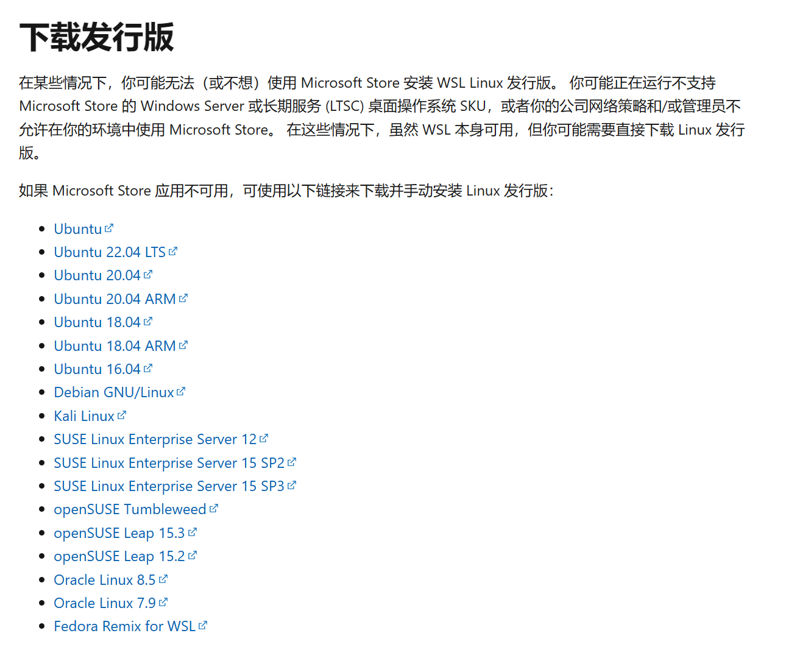

## 起因

通过微软商店或WSL --install安装的WSL会安装在C盘，如果需要安装在其他盘，有如下方法。

## 安装时指定

### 安装包下载

[旧版 WSL 的手动安装步骤 | Microsoft Learn](https://learn.microsoft.com/zh-cn/windows/wsl/install-manual)

以上为微软官网的WSL地址，需要通过下载手动安装包进行，页面往下，找到

选择一个需要的系统下载即可，这里以Ubuntu20.04为例。

### 处理安装包

下载下来的安装包一般为 `.appx` 文件



将其后缀修改为 `.zip` 或者直接使用压缩软件打开



将其解压缩到**指定安装位置**的地方

### 安装

运行 `.exe` 文件，执行安装过程即可。

### 原理

安装后会发现一个 `.vhdx` 文件被创建在了之前解压指定的文件夹内

这个就是WSL的虚拟磁盘文件，也就是说，WSL被安装到了指定位置。